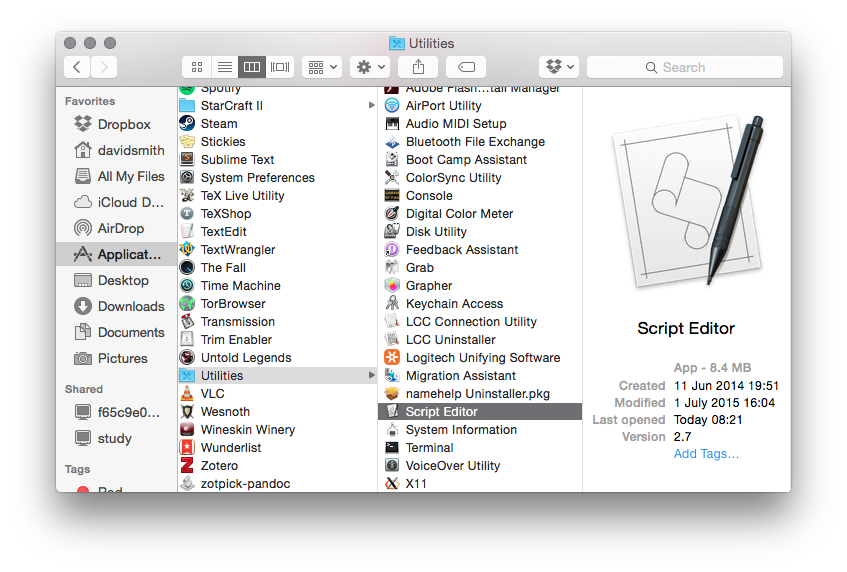
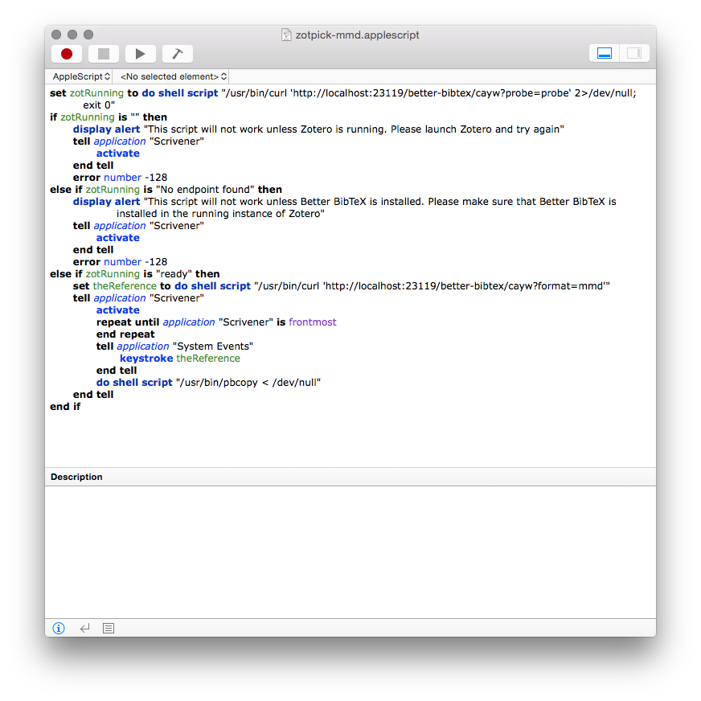
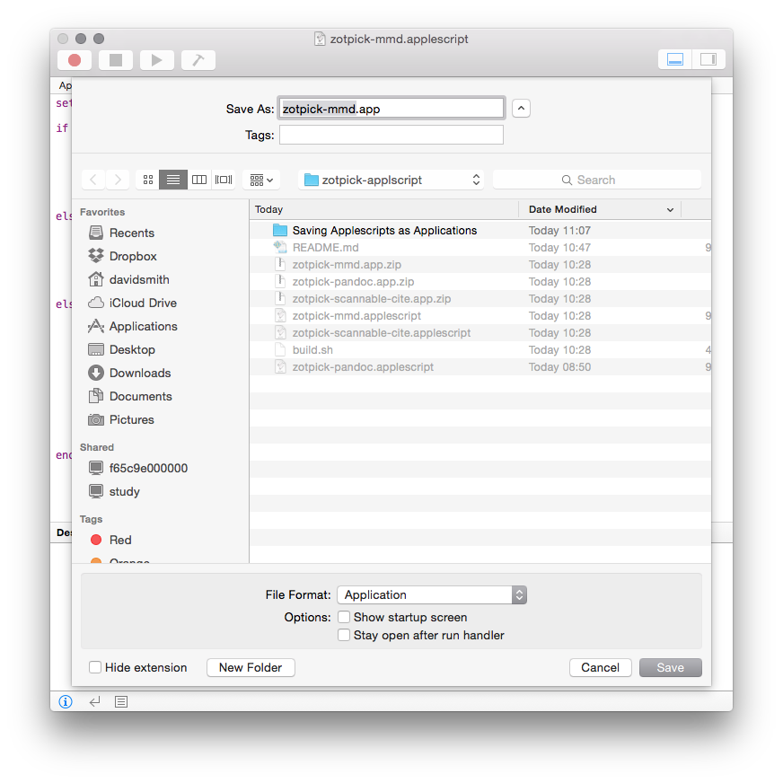

# How to save an applescript as an Application

1. Open **Script Editor** from the *Utilities* folder in *Applications*

2. Paste the Script into the edit window

3. Click File -> Save as -> Application
